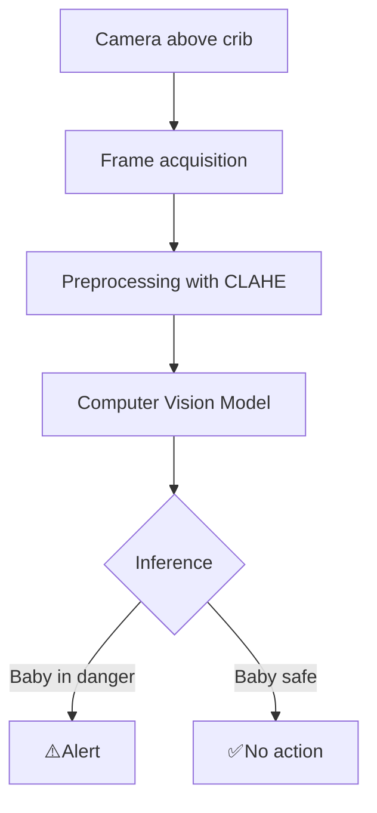
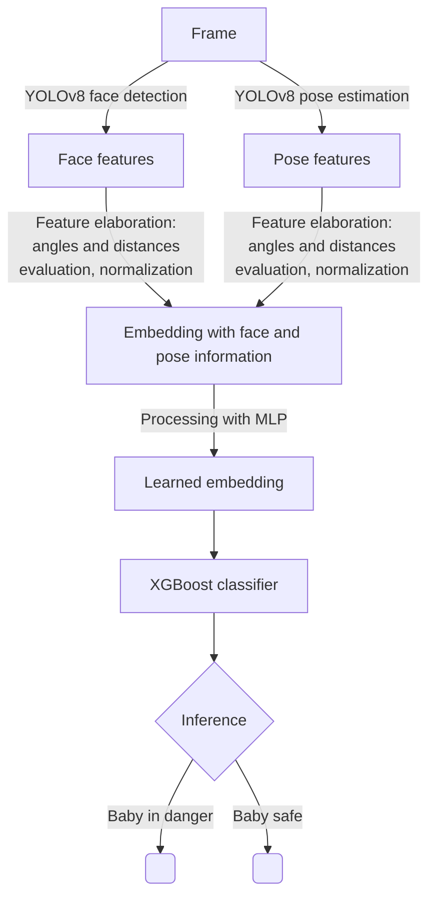
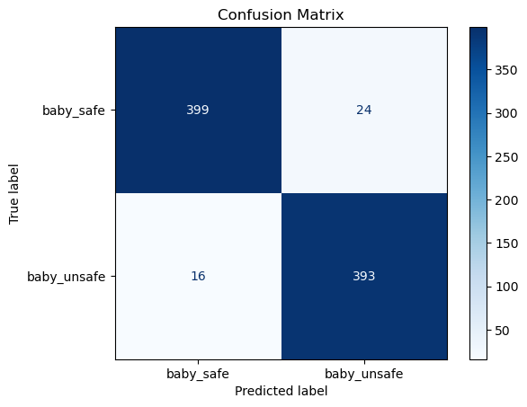
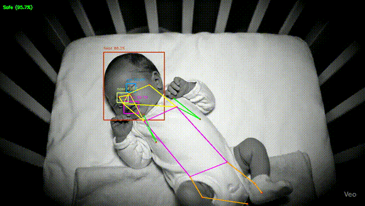

# SIDS DETECTOR

📖 Table of Contents

- [🎯 Project Goal](#-project-goal)  
- [❓ Problem Definition](#-problem-definition)  
- [💡 Proposed Solution](#-proposed-solution)  
- [🔄 System Workflow](#-system-workflow)  
- [🧠 Computer Vision Model Pipeline](#-computer-vision-model-pipeline)  
  - [🔍 YOLOv8 Face Detection](#-yolov8-face-detection-model)  
  - [🏃 YOLOv8 Pose Estimation](#-yolov8-pose-estimation-model)  
  - [🛠️ Feature Engineering & Embedding](#-feature-engineering--embedding)  
  - [📊 XGBoost Classifier](#-xgboost-classifier)  
- [🎥 Qualitative Results](#-qualitative-results)  
- [📦 Installation](#-installation)  
- [🚀 Running the Project](#-running-the-project)  
- [📊🖼️ Output](#-output)

## 🎯 Project goal
This project aims to develop a computer vision–based **monitoring system** to track infants while they sleep and detect potentially dangerous positions that may increase **the risk of Sudden Infant Death Syndrome (SIDS)**.
## ❓Problem definition
SIDS is strongly associated with situations in which a baby’s airways become obstructed during sleep.The sleeping position plays a critical role:
- 🟥 **Prone position** (lying face down) – highest risk of suffocation. 
- 🟧 **Side positions** (lying on the left or right side) – increased risk if the baby’s mouth and nose are pressed against the mattress, pillow, or blanket.
- 🟩 **Supine position** (on the back, face up) → safest position, airways unobstructed.

**In this project, we define:**
- **Baby Safe**: infant is in a safe sleeping position.
- **Baby in Danger**: infant is in a potentially risky position.

## 💡 Proposed solution
We aim to create a smart baby monitor positioned above the crib, continuously analyzing video frames in real time.

At this stage of development, our focus is on the computer vision model, responsible for:
- Analyzing video frames in real time.
- Detecting the baby’s body pose and face features.
- Classifying frames as "baby safe" or "baby in danger".

➡️ Future work will integrate this into a real monitoring device, connected to an alert system to notify parents when a dangerous posture is detected.

## 🔄 System Workflow
Overall, the smart baby monitor works like this:

## 🧠 Computer vision model pipeline
During this stage, we focused on the computer vision model, whose processing pipeline includes:

### 🔍 YOLOv8 face detection model
The first element of our pipeline is the YOLOv8 face detection model
It was fine-tuned with [this dataset](https://app.roboflow.com/sids-project-3gvel/dataset_v3-hn7xa/1) after careful data augmentation.

### 🏃 YOLOv8 pose estimation model
The second element of our pipeline is the YOLOv8 pose estimation model.
It was fine-tuned with [this dataset](https://universe.roboflow.com/sids-project-3gvel/pose_estimation-merged-gdksv/dataset/1m) after careful data augmentation.

### 🛠️ Feature Engineering & Embedding
From YOLO outputs, we extract handcrafted features (86 total):
- **Face-related**: landmark presence, normalized positions, geometric relations (angles, aspect ratios, eye-to-mouth distances).
- **Pose-related**: normalized keypoints, distances between joints, torsion, and angles.

➡️ These features are passed through an MLP trained with Supervised Contrastive Loss, producing a 32-dimensional learned embedding.

### 📊 XGBoost classifier
- Multiple classifiers were tested with hyperparameter optimization, and the best one was selected to predict “baby safe” or “baby in danger”.
- XGBoost achieved the best balance of:
	- ✅ High recall (especially for “baby in danger” cases).
	- ✅ Strong accuracy.
	- ✅ Low overfitting tendency.

| | **precision** | **recall** | **f1-score** | **support** |
| :--- | :---: | :---: | :---: | :---: |
| **baby_safe** | 0.96 | 0.94 | 0.95 | 423 |
| **baby_unsafe** | 0.94 | 0.96 | 0.95 | 409 |
| | | | | |
| **accuracy** | | | 0.95 | 832 |
| **macro avg** | 0.95 | 0.95 | 0.95 | 832 |
| **weighted avg**| 0.95 | 0.95 | 0.95 | 832 |

## 🎥 Qualitative results

Our model is frame-based. Future work may include inter-frame analysis to stabilize predictions, but this provides a solid foundation for further refinement.

The demo video was AI generated using VEO.

## 🔧 Installation
In progress
## 🚀 Running the Project
In progress
## 🖼️ Output
In progress

