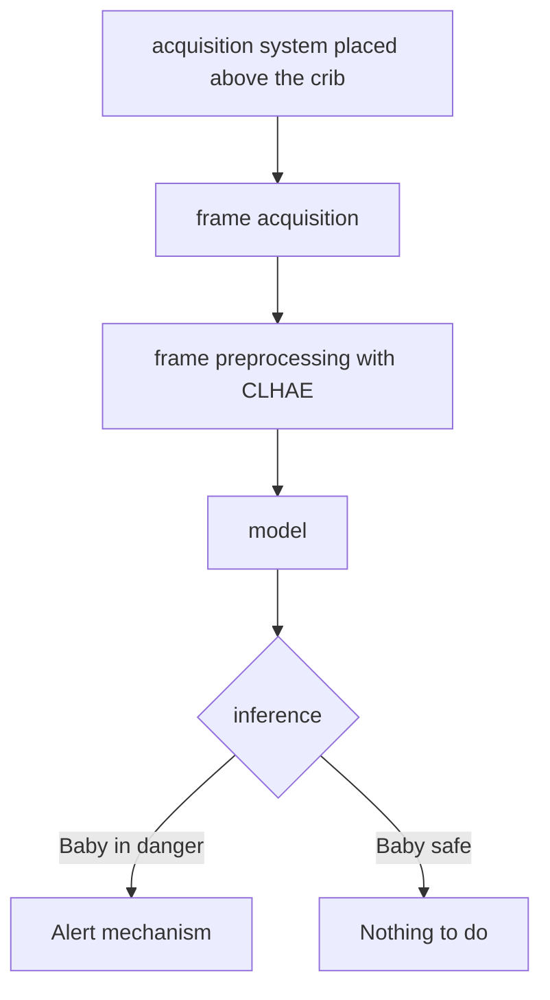
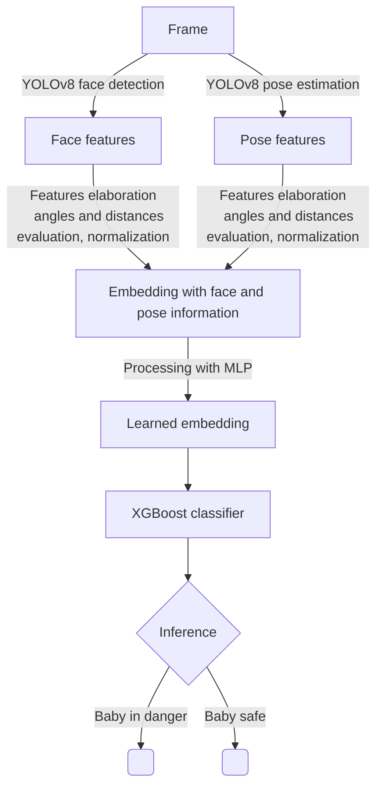
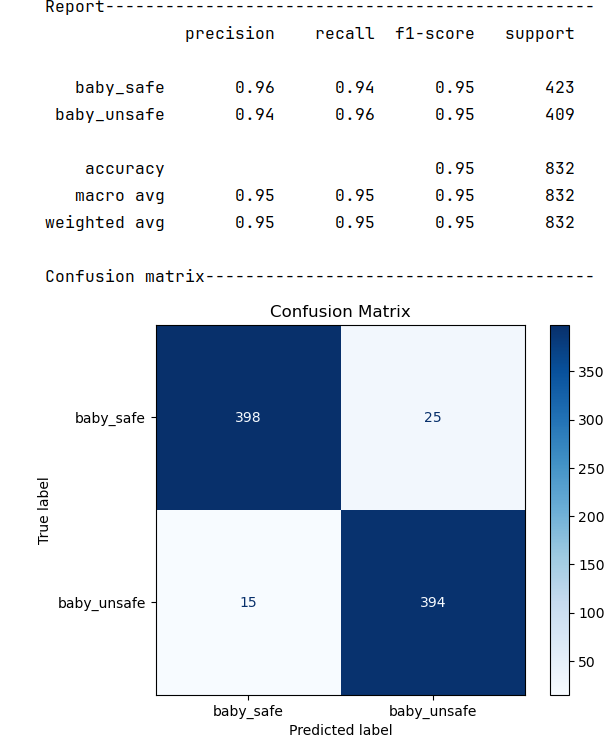
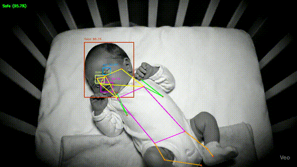

# SIDS DETECTOR

## Project goal
The goal of this computer vision project is to **monitor** infants while they are asleep in their crib and to detect potentially dangerous sleeping positions that may increase **the risk of Sudden Infant Death Syndrome (SIDS)**.

## Problem definition
SIDS is strongly associated with situations in which a baby’s airways become obstructed during sleep.\
The most critical risk factors involve the baby’s position:
1. Prone position (lying face down) – highest risk of suffocation. 
2. Side positions (lying on the left or right side) – increased risk if the baby’s mouth and nose are pressed against the mattress, pillow, or blanket.

The safest position is the supine position (lying on the back, face up) with the mouth and nose unobstructed.

\
**In this project, we define:**
- **Baby Safe**: all the frames in which the baby is in a safe sleeping position.
- **Baby in Danger**: all the frames in which the baby assumes a potentially dangerous position.

## Proposed solution
The goal of this project is to develop a smart baby monitor that can be placed above the crib to continuously acquire video of the infant while sleeping. The system integrates a computer vision model capable of detecting potentially dangerous sleeping positions.

At this stage of development, we focus specifically on the computer vision model, which is responsible for:
- Analyzing video frames in real-time.
- Detecting the baby’s body pose and face features.
- Classifying frames as "baby safe" or "baby in danger".

Future steps will include integrating the model into a real monitoring device and connecting it to an alert system to notify parents when a dangerous posture is detected.

## Approach
Overall, the smart baby monitor works like this:

## Computer vision model pipeline
As mentioned before, during this stage with focused on the computer vision model.
Focusing on it, this is the processing pipleine:

### YOLOv8 face detection model
The first element of out pipeline is the YOLOv8 face detection model
It was fine-tuned with https://app.roboflow.com/sids-project-3gvel/dataset_v3-hn7xa/1 after careful data augmentation.

### YOLOv8 pose estimation model
The second element of our pipeline is the YOLOv8 pose estimation model.
It was fine-tuned with https://universe.roboflow.com/sids-project-3gvel/pose_estimation-merged-gdksv/dataset/1m after careful data augmentation.

### Features elaboration and embedding with face and pose information
Bounding boxes and keypoints inferred by previous models are used to create an 86 elements embedding containing handcrafted features:
- flags, which represent presence of facial landmarks
- facial landmarks positions
- facial landmarks positions normalized wrt frame dimensions
- additional facial information, evaluated geometrically: horizontal and vertical angle, width/height ration, eyes distance and mouth-nose distance

- keypoints positions normalized wrt the body of the baby
- additional pose information, evaluated geometrically: semantically meaningful distances between joints, body torsion, joints angles

### From handcrafted to learned embeddings
The handcrafted embeddings have been exhaustively analyzed basing on retrieval and classification metrics.
After many attempts to improve their informational content, it was determined that the most efficient way is to pass them as input of a Multi Layer Perceptron trained with Supervised Contrastive Loss.

The input of the MLp is an embedding with 86 handcrafted features, the result is an embedding with 32 learned features.

### XGBoost classifier
The last phase of the pipeline consists in the classifier that finally outputs the prediction "baby safe" or "baby in danger".
Many classifiers have been trained and compared, hyperparameters optimization has been run and succesively the classifiers with the best performances was chosen.

In particular, the chosen classifier is an XGBoost model with optimized hyperparameters
It is the one which shows less overfitting trend, with a really high recall detecting "baby in danger"(given the sensible task) and with a high accuracy too.

## Frame preprocessing with CLHAE filters

## Qualitative results

